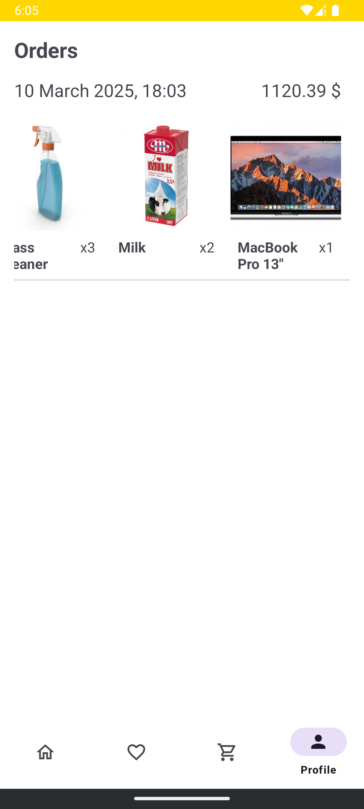
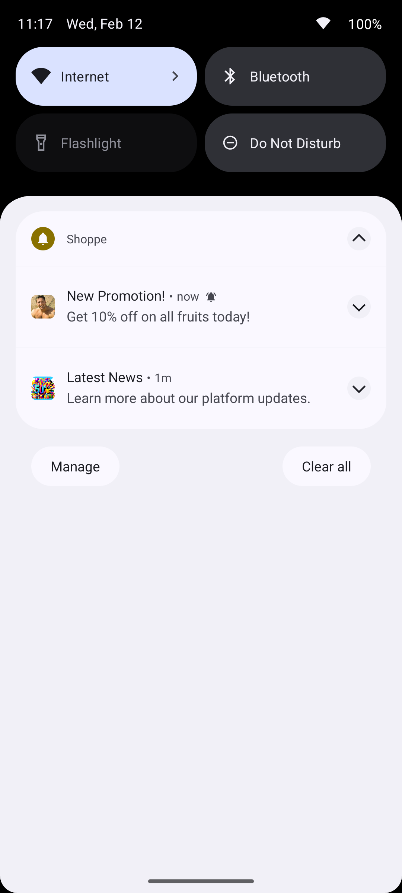
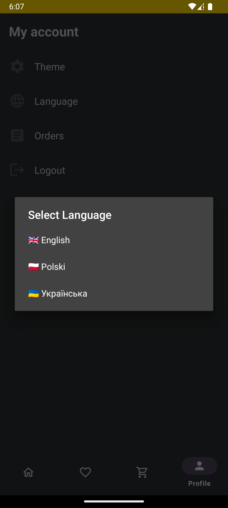

# 📱 Mobile Retail Application

{:width="=200px"}

## 🛒 About the Project
This mobile application seamlessly integrates traditional retail with e-commerce, allowing users to:  
✅ Browse products 🛍️  
✅ Place orders 🛒  
✅ Make payments 💳  
✅ Manage their data 👤

---

## 🚀 Key Features

### 🔍 Product Catalog
Users can browse an extensive catalog of products, search by category, subcategory, and view product details.

{:width="400px"}

### 🛍️ Shopping Cart & Checkout
Items can be added to the cart, where users can adjust quantities before proceeding to secure checkout.  

{:width="400px"}
{:width="400px"}

### 🔑 User Authentication
Two registration options:  
1️⃣ **Email registration & verification**  
2️⃣ **Google Sign-In**

{:width="400px"}

### 📊 Order Tracking & History
Users can track their order status and view their purchase history.  

{:width="400px"}

### 🔔 Push Notifications
Stay updated with promotions, order status changes, and personalized offers.

{:width="400px"}

### 🌍 Language & Theme Support
The app supports both language and theme customization:

- Language: Users can switch between different languages (English, Ukrainian, Polish).
- Theme: Choose between a Light or Dark theme for a personalized viewing experience.

{:width="400px"}

---

## 🛠️ Tech Stack

### 📌 Libraries Used:
- **Hilt/Dagger**
- **Navigation & Safe Args**
- **Material Design**
- **Glide**
- **JUnit & Espresso**
- **Coroutines**
- **Mockito**

### 🔗 Technologies:
- **Kotlin**
- **Firebase:**
    - Firestore Database
    - Authentication
    - Firebase Analytics
    - Firebase Messaging
- **Architecture:** MVVM + Clean Architecture  

---

## 📲 Supported Versions

The app is designed and tested on:  
1. **Android 9.0 (API 28) – Android 15 (API 35)**  
2. Developed using **Android Studio Koala 2024.1.1** and **AGP 8.5.2**
3. Gradle 8.9

---

# 📲 How to Run the App on Your Phone

## 1️⃣ Download & Install
- Install the APK file on your Android device.

## 2️⃣ Sign In or Register
To access all features, you need to create an account.  
You can sign up using:  
- **Email registration & verification**  
- **Google Sign-In**

## 3️⃣ Skip Registration (Test Access)
If you just want to explore the app, you can log in using a test account:

- Email: testaccount@gmail.com
- Password: Test1234!

## 4️⃣ Enjoy the App! 🎉

## 🔬 Testing
The project includes both unit and UI tests:

- JUnit – Unit testing
- Espresso – UI testing